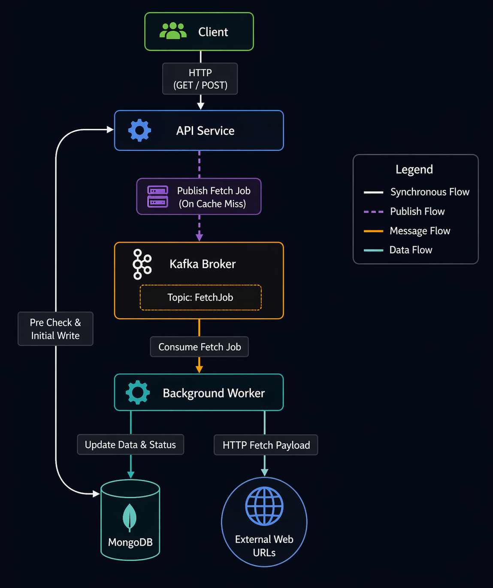

# Architecture & Implementation Notes

This document provides a high-level overview of how the HTTP Metadata Inventory Service was built. It reflects the exact architecture and behaviors currently implemented in the repository.

## Architecture Overview

  

The system is designed around a clean, decoupled architecture:
- **API Service**: Handles incoming HTTP requests, validates URLs, and either performs inline fetching or delegates to the background worker via Kafka.
- **Background Worker**: A standalone Go application that continuously consumes Kafka messages to process URL fetches asynchronously. This prevents the API from being blocked by slow external sites or large payloads.
- **MongoDB**: Used as our primary data store. We index records using a unique `url_hash` instead of raw URLs to optimize query performance and enforce uniqueness guarantees cleanly.
- **Kafka**: Acts as the message broker between the API and Worker. If fetch requests fail, the worker respects retry semantics, utilizing a Dead Letter Topic (DLT) when max retries are exceeded.

## Core API Behavior

- **POST `/v1/metadata`**: When you submit a URL, the API validates it. Under normal operation (or when feature flags dictate), it will attempt to fetch and store the metadata synchronously, returning a `201 Created`. If the system is configured strongly for async queueing, it will emit an event and return a `202 Accepted`.
- **GET `/v1/metadata`**: Looks up the URL. If the metadata is cached and ready, it returns `200 OK` instantly. On a cache miss, to ensure fast API responsiveness, it dispatches a fetch job to Kafka and immediately returns `202 Accepted` to let the client know processing is underway.

## Implementation Details

- **Language & Toolchain**: Written purely in Go `1.25` relying heavily on interface-driven design.
- **Resilience**: Database logic uses strict context timeouts. Kafka connections safely rebalance.
- **Feature Flags**: Environment variables natively control the system's behavior (e.g., `FF_ASYNC_FETCH_ONLY` forces all traffic to be handled asynchronously).
- **Observability**: Implemented structural logging, basic Prometheus metric endpoints, and panic recovery middleware.

## Testing Strategy

All testing targets use standardized Docker and Make methodologies:
- **Unit & Integration**: Standard Go test suite.
- **End-to-End (E2E)**: Tests spin up a full Docker Compose cluster, run full-scale data submissions ensuring synchronous and asynchronous transitions work correctly, and validate database persistence before tearing the cluster back down safely.

## Future Opportunities

As the project scales, a few logical next steps would include:
- Wiring up a true HTTP Circuit Breaker for the worker to prevent overwhelming struggling downstream sites.
- Expanding the playbook for handling an influx of Kafka DLT failures.
- Iteratively improving Go test coverage.
